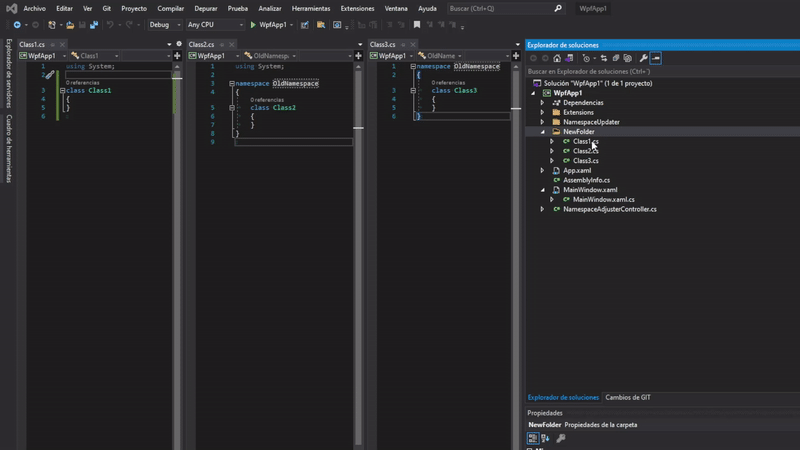

# VSNamespaceAdjuster
*Created by Eric Batlle Clavero*

 A simple Visual Studio extension to select one or multiple .cs files and adjust them with the specified Namespace.

This extension is available in the [Marketplace](https://marketplace.visualstudio.com/items?itemName=EricBatlleClavero.namespaceAdjuster).

## Video-Example 🎬

<p>
  
</p>

## Donations are appreciated! 💸
*Remember that are many ways to say thank you.*

If this extension has been helpful remember to star the repository and consider buying me a coffee! 😀 
<p>
<a href="https://www.buymeacoffee.com/ebatlleclavero" target="_blank"></a>
</p>

If you like my general work and contributions consider [sponsoring me on Github](https://github.com/sponsors/EricBatlle). 

But if you just want to donate straightforward, I also have [PayPal.me](https://paypal.me/EricBatlleClavero?locale.x=es_ES).

## Supported file extensions

- .cs
- .vb

## Contribute and add support for more file extensions

If you want to open a PR and contribute to this plugin I'll be more than happy.

Just remember that if you want to add support for new file extensions please follow the current code pattern:

- Inside ``NamespaceUpdater`` directory create your own ``XXNamespaceUpdaterService.cs`` class.
- Make sure the name starts with the file extension that it supports, like ``CsNamespaceUpdaterService.cs``, clearly indicating that it updates ``Csharp (.cs)`` files.
- Make your class inherit from ``LogicFileNamespaceUpdaterService`` and implement how the Updater should behave.
- Last but not less important, add your service to provider ``FileNamespaceUpdaterProvider`` list, inside it's constructor.
```csharp
public FileNamespaceUpdaterProvider()
{
  updaterServices.Add(new CsNamespaceUpdaterService());
}
```

I'll appreciate any contribution!